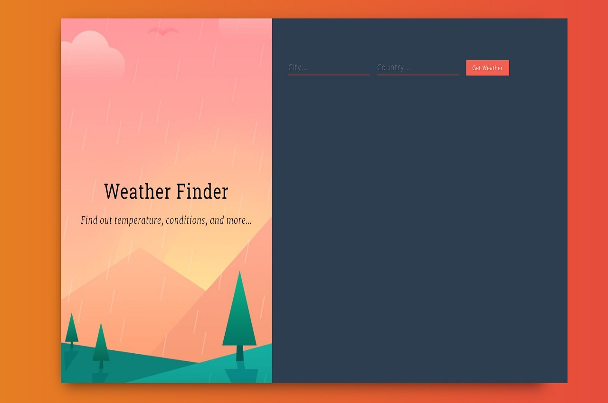

# Weather Finder
This app allows a user to input a city and a country to receive information about the local weather.
The data the user receives includes:  
&nbsp;&nbsp;-Temperature  
&nbsp;&nbsp;-Humidity  
&nbsp;&nbsp;-Description of the current conditions

# Motivation
My initial goal was to create an app built with React. I then wanted to try and utilize an
API to retrieve information based upon the weather. The lacking pieces of this project are it's responsiveness
due to my focus on the React piece of the project.

# Screenshots

# Tech/framework used
**Built with**  
&nbsp;&nbsp;[-React](https://github.com/facebook/react)

# Features
The main feature of this app is the ability of a user to search for weather for a particular city.
It retrieves this data from an API and displays it in the UI.

# Code Example

    const Weather = (props) => {
    return (
        

            { 
            props.city && props.country &&  
Location:
                 { props.city }, { props.country }

            }       
            { 
            props.temperature && 
Temperature:
                 { props.temperature }

            }         
            { 
            props.humidity && 
Humidity:
                 { props.humidity }
 
            }
            { 
            props.description && 
Conditions:
                 { props.description }
 
            }
            { 
            props.error && 
{ props.error }

            }
        
  
    );
    }

    export default Weather;

# Installation
npm install weather

# License
MIT © Matt Habeck
